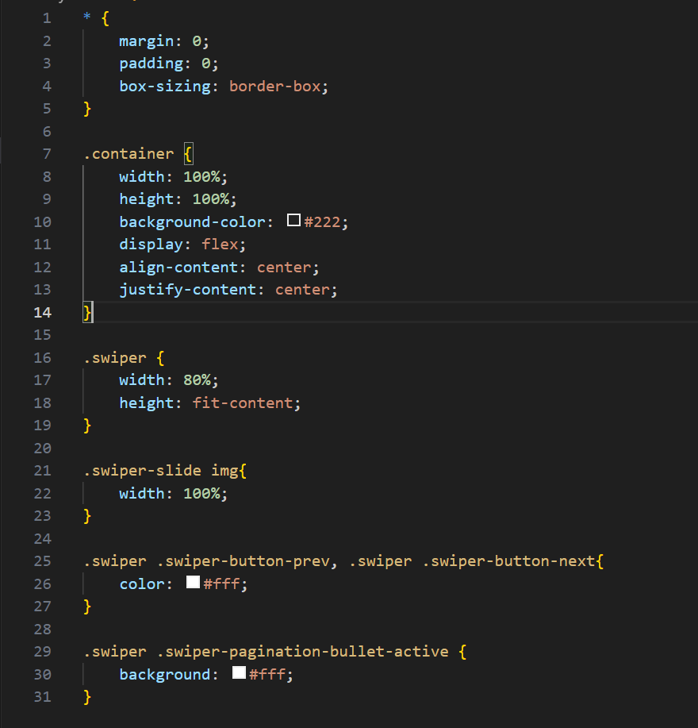
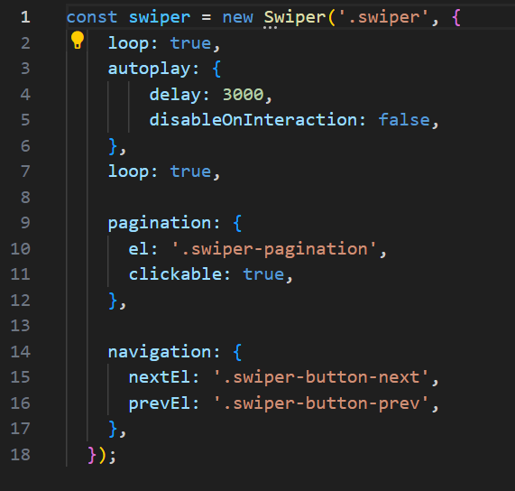
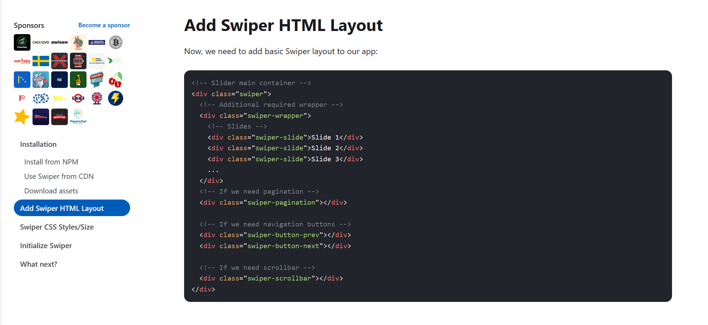
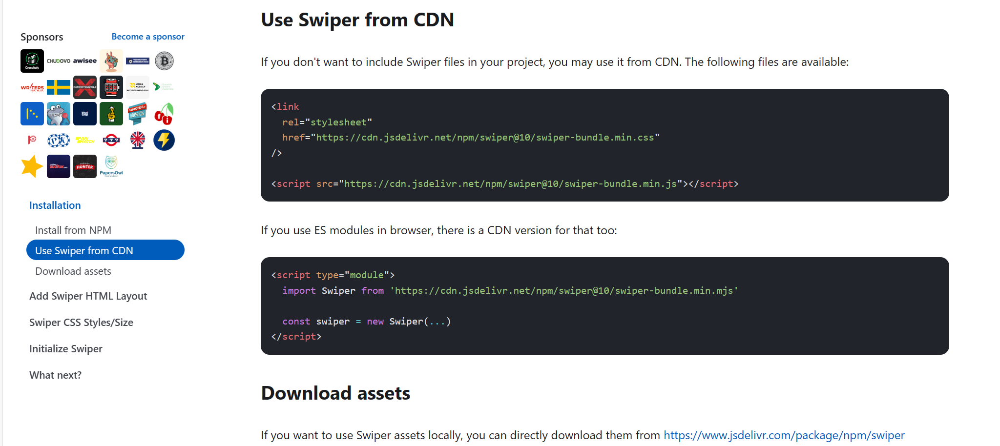
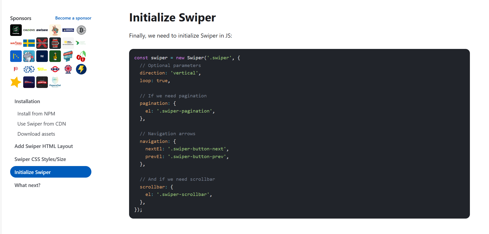
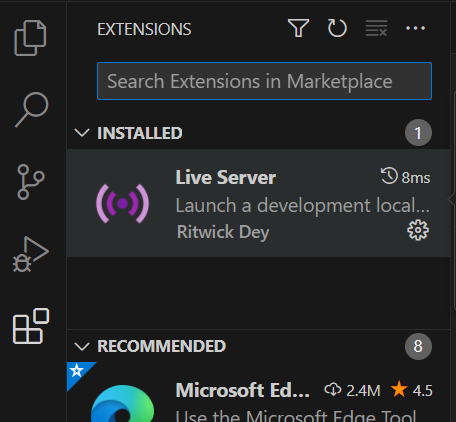

# Image Slider

An image slider website where the user can press the left or right arrow buttons to shuffle through different computer images (four total images). The webpage will automatically shift through the images to the right if the user doesn't press any of the two buttons for a certain period of time.

This website exists to implements transitions and to utilize slideshows for different images so that these skills can be implemented into real world websites i.e. promoting different clothing and so on.

## Core Technical Concepts

CSS for the project. 

The JavaScript for the website. The code clickable: true is added so that the four dots shown at the bottom of the screen are clickable. This makes it so that clicking on any of the four dots brings the user to the selected image i.e. clicking the first dot shows the first image in the slideshow and so on.

## Getting Started/Requirements

To run this website, download the code from [github.com/JCV2022/About-Me-Website](https://github.com/JCV2022/About-Me-Website)

To get the source code for the CSS and JavaScript, type in this link [Swiper - The Most Modern Mobile Touch Slider (swiperjs.com)](https://swiperjs.com/) and click on 'Get Started'.

Scroll down to 'Add Swiper HTML Layout' and copy everything in the block shown below except for the "swiper-scrollbar". This div isn't used in this project. Paste the whole HTML in the HTML file. This was used as a base layout for the index.html file.

Go back up to 'Use Swiper from CDN' then copy the first block. Paste the <link> in head tag of the HTML file. Paste the <script> in the <body> at the bottom.

Go to 'Initialize Swiper' and go down to 'Initialize Swiper'. Copy the block of code and paste it in a JavaScript file. Delete the scrollbar function.

A code editor program is needed. Any should do fine, I used Visual Studio Code to code my website.

If you do use Visual Studio Code as your code editor, install the extension Live Server to be able to run the code in real-time.

## Todo

Make the JavaScript take product quantities inputted into consideration when manipulating the number added to the cart i.e. adding 10 basketballs to the cart should increment the number added to the cart to 10 not 1. 

Add functionality to the checkout.html. Right now, only displays two set products and can't checkout.

Edit tracking.html to take orders placed and track them. Set orders are in place by default.

Complete cart.js and checkout.js files.

## Contact Info

My email address is vujonathan00@gmail.com

My github is github.com/JCV2022

My linkedIn is linkedin.com/in/jonathan-vu-409a71132/
